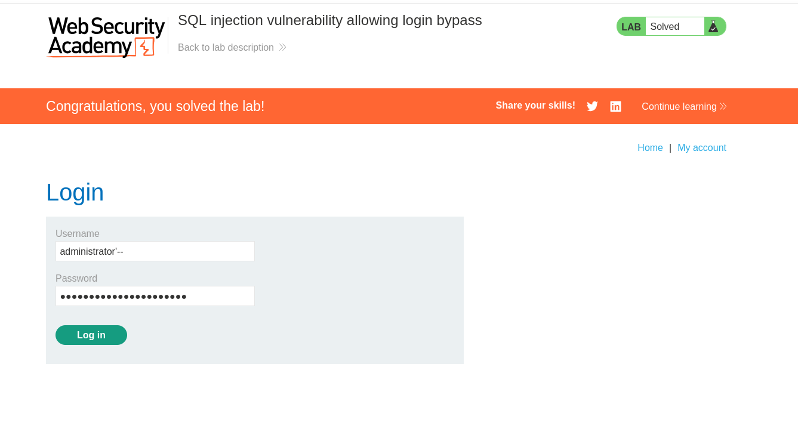
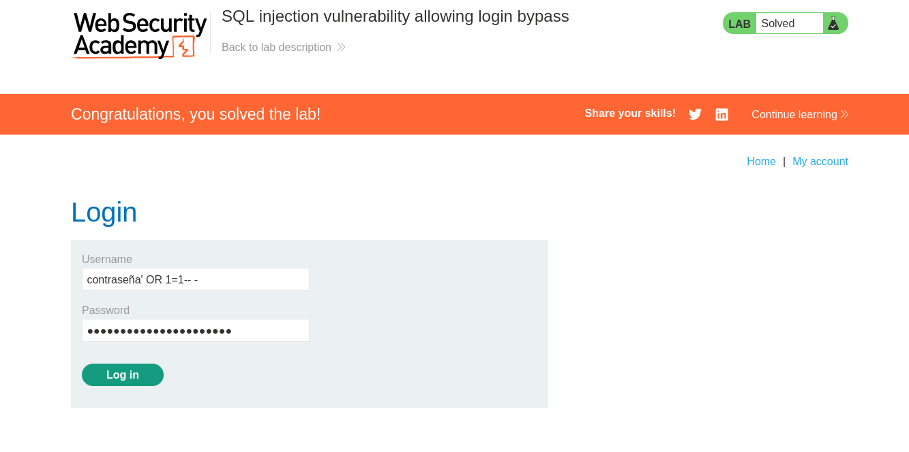

# SQL Injection Vulnerability Allowing Login Bypass

Laboratorio de **PortSwigger Web Security Academy** enfocado en una vulnerabilidad de **SQL Injection en el sistema de autenticación** que permite **evadir el mecanismo de login**.

El objetivo del laboratorio es **iniciar sesión como el usuario `administrator` sin conocer su contraseña**, manipulando la consulta SQL utilizada para validar las credenciales.

---

# 🎯 Objetivo del Laboratorio

La aplicación contiene una vulnerabilidad en el formulario de autenticación.

Los valores introducidos en los campos:

* `username`
* `password`

se insertan directamente dentro de una consulta SQL utilizada para verificar las credenciales.

Esto permite modificar la lógica de la consulta SQL y **evadir la verificación de contraseña**.

---

# 🌐 Página de Login

La aplicación presenta un formulario de autenticación estándar.

<p align="center">

</p>

---

# 🧠 Concepto de la Vulnerabilidad

La vulnerabilidad ocurre cuando una aplicación **construye consultas SQL utilizando directamente datos proporcionados por el usuario**.

Por ejemplo:

```sql
SELECT * FROM users WHERE username = 'USER' AND password = 'PASS';
```

Si los valores introducidos no se validan correctamente, un atacante puede **inyectar código SQL adicional** para modificar el comportamiento de la consulta.

---

# 🔎 Posible Consulta SQL Original

La aplicación probablemente ejecuta una consulta similar a la siguiente:

```sql
SELECT * FROM users 
WHERE username = 'administrator' 
AND password = 'contraseña';
```

Esta consulta solo debería devolver resultados si **el nombre de usuario y la contraseña coinciden exactamente**.

---

# 💥 Método 1 — Bypass usando el parámetro `username`

Se introduce el siguiente valor en el campo **username**:

```sql
administrator'--
```

La contraseña puede ser **cualquier valor**.




---

## Explicación del Payload

### Cierre de la cadena

El carácter:

```sql
'
```

cierra la cadena de texto utilizada en la consulta SQL.

---

### Comentario en SQL

La secuencia:

```sql
--
```

indica el inicio de un comentario en SQL.

Todo lo que aparece después **es ignorado por el motor de base de datos**.

---

## Consulta resultante

```sql
SELECT * FROM users 
WHERE username = 'administrator'--' 
AND password = 'cualquier_valor';
```

Debido al comentario (`--`), la verificación de la contraseña **queda desactivada**.

---

## Resultado

La consulta se reduce a:

```sql
username = 'administrator'
```

Si el usuario existe, el sistema permite el acceso.

---

# 💥 Método 2 — Bypass usando el parámetro `password`

Otra forma de resolver el laboratorio es modificar el campo **password**.

Valor enviado:

```sql
contraseña' OR 1=1-- -
```

El campo **username** puede ser cualquier usuario válido o incluso cualquier valor.



---

# Explicación del Payload

## Cierre de la cadena

```sql
'
```

Cierra la cadena correspondiente al campo contraseña.

---

## Condición siempre verdadera

```sql
OR 1=1
```

Esta expresión **siempre se evalúa como verdadera**.

---

## Comentario SQL

```sql
-- -
```

Comenta el resto de la consulta SQL.

---

# Consulta SQL Resultante

```sql
SELECT * FROM users 
WHERE username = 'administrator' 
AND password = 'contraseña' OR 1=1-- -';
```

Debido a la condición:

```sql
OR 1=1
```

la consulta siempre se evalúa como verdadera.

---

# 📊 Resultado del Ataque

El sistema permite iniciar sesión sin conocer la contraseña real.

<p align="center">

</p>

---

# 🔐 Impacto de la Vulnerabilidad

Este tipo de vulnerabilidad puede permitir a un atacante:

* Acceder a cuentas sin conocer las credenciales
* Escalar privilegios
* Acceder a información sensible
* Comprometer completamente la aplicación

En escenarios reales, podría permitir **acceso administrativo completo al sistema**.

---

# 🛡️ Cómo Prevenir Esta Vulnerabilidad

Para evitar este tipo de ataques es necesario implementar varias medidas de seguridad.

### 1. Consultas Parametrizadas

Ejemplo seguro:

```sql
SELECT * FROM users 
WHERE username = ? 
AND password = ?;
```

---

### 2. Prepared Statements

Separan los **datos del usuario** de la **lógica de la consulta SQL**.

---

### 3. Validación de Entradas

Validar y sanitizar los datos proporcionados por el usuario.

---

### 4. Uso de ORM

Los **Object Relational Mappers** reducen significativamente el riesgo de SQL Injection.

---

# ✅ Conclusión

Este laboratorio demuestra cómo una **inyección SQL simple en el sistema de autenticación** puede permitir evadir completamente el proceso de login.

La vulnerabilidad ocurre porque la aplicación **inserta directamente los datos del usuario dentro de una consulta SQL**, permitiendo que un atacante altere su lógica mediante payloads como:

```sql
administrator'--
```

o

```sql
' OR 1=1-- -
```

Este tipo de fallos sigue siendo una de las vulnerabilidades más críticas en aplicaciones web.

---

